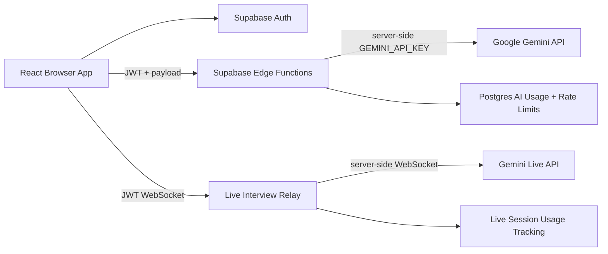

# Security Remediation Report

## Summary

This branch removes direct Gemini access from the browser and routes AI features through authenticated Supabase Edge Functions. The browser now only receives Supabase public configuration (`VITE_SUPABASE_URL`, `VITE_SUPABASE_ANON_KEY`). Gemini credentials are read only from Supabase Secrets inside Edge Functions.

## Implemented Changes

- Removed `@google/genai` from frontend dependencies.
- Removed stale browser importmap entry for `@google/genai`.
- Removed `GEMINI_API_KEY` injection from `vite.config.ts`.
- Added Supabase client integration for auth and Edge Function calls.
- Replaced mock auth with Supabase email/password auth.
- Moved ATS analysis/scoring to `supabase/functions/ats-analysis`.
- Moved resume bullet enhancement to `supabase/functions/resume-enhancement`.
- Added resume summary generation through `supabase/functions/resume-summary`.
- Moved interview feedback to `supabase/functions/interview-feedback`.
- Added centralized AI router shared by all text-based functions.
- Added live interview WebSocket relay at `supabase/functions/live-interview-relay`.
- Added AI usage/rate-limit/live-session schema migration.

## Updated Architecture



## AI Router Summary

Text AI features share `supabase/functions/_shared/ai-router.ts`.

- `ats-analysis`: preserves the existing resume/JD prompt and JSON result schema (file-based).
- `resume-scan`: powers the Resume Scanner UI. Accepts already-extracted resume text plus an optional job description and returns `{ score, strengths, missingKeywords, suggestions }`. Resume files are parsed in the browser (pdf.js / mammoth) before this call.
- `resume-enhancement`: preserves the existing action/context/result bullet rewrite prompt.
- `resume-summary`: adds a backend-only summary generation route required for remediation.
- `interview-feedback`: preserves the existing interview scoring JSON prompt and schema.

Every text AI function:

- requires a valid Supabase JWT,
- checks rate limits through `check_ai_rate_limit`,
- calls Gemini server-side,
- records usage through `record_ai_usage_event`.

## WebSocket Relay Design

`live-interview-relay` accepts only WebSocket upgrades. The browser connects with a Supabase access token and session metadata. The relay:

- validates the Supabase JWT,
- enforces `live-interview` rate limits,
- creates a tracked `ai_live_sessions` row,
- opens an outbound WebSocket to Gemini Live using the server-side secret,
- sends the preserved interview setup/system instruction,
- relays browser audio events to Gemini,
- relays Gemini audio/transcript events back to the browser,
- records duration and byte usage when the socket closes,
- closes sessions after a 10-minute maximum duration.

## Verification

Commands run:

```bash
npx tsc --noEmit
npm run build
```

Search verification:

```bash
rg "@google/genai|GoogleGenAI|process\.env\.API_KEY|process\.env\.GEMINI_API_KEY|generateContent|live\.connect" src vite.config.ts index.html package.json
```

Result: no direct Gemini SDK imports, no browser `GoogleGenAI` construction, no Gemini API key injection, and no stale browser Gemini importmap entry remain in frontend code.

Known remaining build warning: `index.html` references `/index.css`, which does not exist at build time. This predates the security remediation.

## Deployment Requirements

1. Apply database migration:

```bash
supabase db push
```

2. Store Gemini key as a Supabase Secret:

```bash
supabase secrets set GEMINI_API_KEY=your_gemini_key
```

3. Deploy Edge Functions:

```bash
supabase functions deploy ai-router
supabase functions deploy ats-analysis
supabase functions deploy resume-enhancement
supabase functions deploy resume-summary
supabase functions deploy interview-feedback
supabase functions deploy live-interview-relay
```

4. Configure frontend environment:

```bash
VITE_SUPABASE_URL=https://your-project-ref.supabase.co
VITE_SUPABASE_ANON_KEY=your-public-supabase-anon-key
```

5. Ensure Supabase Auth email/password provider is enabled.

## Cost Impact

- Frontend bundle no longer includes Gemini SDK, reducing the main production bundle from about 587 KB to about 480 KB minified in local builds.
- Server-side routing enables usage tracking, rate limits, and per-feature cost attribution.
- Added Supabase function/database costs are expected to be modest at MVP scale.
- Gemini costs become more controllable because anonymous unauthenticated calls are blocked.
- Live interview remains the primary cost risk due to long-running audio sessions; this branch caps sessions at 10 minutes and tracks usage by minute-equivalent request units.

## Residual Risks

- Supabase Edge Function Deno files are excluded from the frontend TypeScript config and should be checked/deployed with Supabase tooling.
- OAuth buttons are still visual placeholders.
- The live relay depends on Gemini Live WebSocket message compatibility and should be tested in a deployed Supabase environment with a real Gemini key.
- `/index.css` missing build warning remains outside this remediation.
